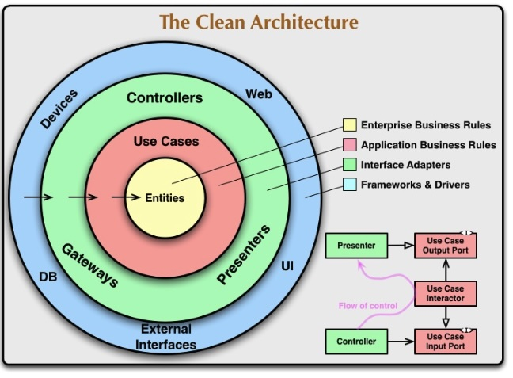

# Clean Architecture



La imagen ilustra el concepto de Clean Architecture, propuesto por Robert C. Martin (conocido como Uncle Bob). Esta arquitectura se basa en una serie de principios que buscan la separación de responsabilidades y la independencia entre capas para crear sistemas mantenibles y robustos. Veamos cada uno de los conceptos clave reflejados en la imagen:

## Capas de la Clean Architecture:

1. Entidades (Enterprise Business Rules):

    * Son las estructuras de datos que representan las reglas y lógica del negocio más central y general. Pueden ser objetos, clases o estructuras que encapsulan reglas básicas que son válidas en cualquier contexto del dominio del negocio.

    * Estas entidades deben ser completamente independientes de detalles externos como bases de datos, frameworks, o tecnologías concretas.

2. Casos de uso (Application Business Rules):

    * Encapsulan la lógica específica de la aplicación que permite realizar operaciones y cumplir con los requisitos del usuario. Son responsables de coordinar las interacciones entre entidades para alcanzar un resultado específico.

    * Esta capa orquesta la lógica y se asegura de mantener las reglas de negocio que se implementan en las entidades.

3. Adaptadores de interfaz (Interface Adapters):

    * Son componentes que permiten la comunicación entre el mundo externo (controladores, interfaces de usuario, sistemas de bases de datos, etc.) y los casos de uso.

    * Los adaptadores de interfaz transforman los datos desde un formato que sea entendible por la capa externa a un formato comprensible por los casos de uso y viceversa. Ejemplos comunes de esta capa incluyen los controllers, presenters y gateways.

4. Frameworks y drivers (Frameworks & Drivers):

    * Esta es la capa más externa y se refiere a todo aquello relacionado con tecnologías específicas, herramientas, librerías o frameworks que puedan cambiar. Aquí se encuentran bases de datos, interfaces de usuario (UI), dispositivos, la web, entre otros.

    * La idea de esta capa es que sea fácilmente reemplazable sin afectar las capas internas. Así, si decides cambiar de base de datos, de framework de UI, o de tecnología para enviar datos a dispositivos, puedes hacerlo sin modificar la lógica central del negocio.

---

## Flujo de control:

El flujo de control va desde las capas externas hacia el núcleo central, y los datos fluyen en la dirección opuesta:

* Desde el mundo externo hacia las entidades: Esto representa que las solicitudes o comandos que provienen de los usuarios, sistemas externos o interfaces, son dirigidas hacia las entidades a través de los casos de uso.

* Desde las entidades hacia el mundo externo: Los resultados de operaciones dentro de las entidades son enviados de regreso al usuario o al sistema externo mediante adaptadores de interfaz.

En esta parte se describen cómo interactúan diferentes componentes, específicamente Controller, Use Case Interactor, Use Case Input Port, Use Case Output Port, y Presenter.

1. Controller:
    * Es el componente que recibe las solicitudes externas, ya sea desde una interfaz web, una API REST, o cualquier otra fuente de entrada. Es el encargado de iniciar el flujo llamando al puerto de entrada del caso de uso.

    * Su objetivo principal es recibir las entradas del usuario y delegarlas al Use Case Interactor a través del Input Port. No debería tener lógica de negocio.
  
2. Use Case Input Port:
    * Es una interfaz que define los métodos que deben ser implementados por el Use Case Interactor. Este puerto de entrada permite desacoplar la solicitud que recibe el controlador de la lógica de negocio del caso de uso.

    * El Input Port actúa como un contrato que debe cumplir el interactor, asegurando así que el controlador solo depende de esta interfaz y no de la implementación concreta.

3. Use Case Interactor:
    * Representa la lógica del caso de uso específico. Es el componente principal que contiene el flujo de la aplicación y la lógica de negocio requerida para ejecutar un caso de uso.

    * Recibe la solicitud del Controller a través del Input Port y, al completar su procesamiento, devuelve un resultado al Output Port.

4. Use Case Output Port:
    * Es otra interfaz que define métodos para la presentación de los resultados. Sirve para abstraer la lógica de presentación del resultado, asegurando que el interactor no dependa de detalles de implementación específicos de presentación.

    * Permite pasar el control al Presenter después de ejecutar el caso de uso.

5. Presenter:
    * Es el encargado de preparar la salida para ser mostrada al usuario o retornada a través de una interfaz (por ejemplo, en formato JSON para una API REST, o como datos estructurados para una interfaz gráfica).
    * Transforma los datos que recibe del Output Port en un formato adecuado para la presentación.

Un flujo típico de control puede ser, donde un Controller (en el caso de una aplicación web, por ejemplo) recibe una solicitud. Este controlador delega la lógica principal a un Use Case Interactor (un caso de uso), el cual interactúa con las Entidades si es necesario. Una vez completada la lógica, el flujo de datos regresa a través de un Presenter, que prepara los datos para ser presentados al usuario en una interfaz de usuario (UI) adecuada.

---

## Principios Clave de Clean Architecture:

1. Independencia del framework: La lógica de negocio no depende de detalles externos. Cualquier tecnología debe ser reemplazable sin afectar el núcleo.

2. Independencia de la base de datos: Las reglas de negocio no deben depender de la base de datos, lo que permite cambiarla sin repercusiones importantes.

3. Independencia de la interfaz de usuario: La lógica de la aplicación debe funcionar independientemente de si la interfaz de usuario es una app móvil, un sitio web o una aplicación de consola.

4. Testabilidad: Gracias a la separación de responsabilidades, es posible probar componentes de forma aislada.

---

## Ejemplo práctico:
Imaginemos una aplicación bancaria que permite a los usuarios transferir dinero entre sus cuentas.

1. Controller:
    * Recibe una solicitud HTTP de un cliente, donde se desea transferir $100 de una cuenta a otra. El Controller recibe esta solicitud y extrae la información necesaria (monto, cuenta de origen, cuenta de destino).

2. Use Case Input Port:
    * Define un método como transferFunds(amount, sourceAccount, destinationAccount) que debe ser implementado por un interactor. Es el contrato que garantiza que la lógica de negocio puede ser invocada desde el controlador.

3. Use Case Interactor:
    * Contiene la lógica de negocio para realizar la transferencia. Verifica que la cuenta de origen tenga suficiente saldo, resta el monto de la cuenta de origen y lo suma a la cuenta de destino. Si algo falla, maneja las excepciones según las reglas de negocio. Una vez realizada la transferencia, genera un objeto de respuesta con el resultado.

4. Use Case Output Port:
    * Define un método como presentTransferResult(result). Es la interfaz que separa al interactor de los detalles de presentación. La implementación concreta de esta interfaz se realizará en el Presenter.

5. Presenter:
    * Toma el resultado de la transferencia y lo convierte en un formato adecuado para ser retornado al cliente. Por ejemplo, si la transferencia fue exitosa, devuelve un mensaje JSON con un estatus "éxito" y los detalles de la transacción.

En este ejemplo, el flujo se vería de la siguiente manera:

1. El Controller recibe la solicitud y llama al Use Case Interactor a través del Use Case Input Port.

2. El Use Case Interactor ejecuta la lógica de negocio y delega el resultado al Use Case Output Port.

3. El Presenter toma el resultado desde el Output Port y lo convierte en una respuesta que puede ser presentada o enviada al cliente.

---

## Ejemplo de Clean Architecture con NestJS

En la imagen también se ilustra un flujo típico de control, donde un Controller (en el caso de una aplicación web, por ejemplo) recibe una solicitud. Este controlador delega la lógica principal a un Use Case Interactor (un caso de uso), el cual interactúa con las Entidades si es necesario. Una vez completada la lógica, el flujo de datos regresa a través de un Presenter, que prepara los datos para ser presentados al usuario en una interfaz de usuario (UI) adecuada.

### Estructura del Proyecto

```
src/
│
├── application/
│   ├── interfaces/
│   │   ├── input-port.interface.ts
│   │   ├── output-port.interface.ts
│   │
│   ├── use-cases/
│       ├── transfer-funds.use-case.ts
│
├── domain/
│   ├── entities/
│   │   ├── account.entity.ts
│   │
│   ├── services/
│       ├── account.service.ts
│
├── infrastructure/
│   ├── controllers/
│   │   ├── account.controller.ts
│   │
│   ├── presenters/
│       ├── transfer.presenter.ts
│
├── app.module.ts
```

### 1. Entidad: `Account` (`domain/entities/account.entity.ts`)

```typescript
export class Account {
  constructor(
    public id: number,
    public balance: number,
  ) {}

  debit(amount: number) {
    if (this.balance < amount) {
      throw new Error('Insufficient balance');
    }
    this.balance -= amount;
  }

  credit(amount: number) {
    this.balance += amount;
  }
}
```

### 2. Servicio de Dominio: `AccountService` (`domain/services/account.service.ts`)

```typescript
import { Injectable } from '@nestjs/common';
import { Account } from '../entities/account.entity';

@Injectable()
export class AccountService {
  private accounts: Account[] = [
    new Account(1, 1000),
    new Account(2, 500),
  ];

  findById(id: number): Account {
    const account = this.accounts.find(acc => acc.id === id);
    if (!account) {
      throw new Error('Account not found');
    }
    return account;
  }
}
```

### 3. Puertos de Entrada y Salida (`application/interfaces`)

#### Input Port (`input-port.interface.ts`)

```typescript
export interface TransferFundsInputPort {
  transferFunds(amount: number, fromAccountId: number, toAccountId: number): void;
}
```

#### Output Port (`output-port.interface.ts`)

```typescript
export interface TransferFundsOutputPort {
  presentTransferResult(result: string): void;
}
```

### 4. Caso de Uso: `TransferFundsUseCase` (`application/use-cases/transfer-funds.use-case.ts`)

```typescript
import { TransferFundsInputPort } from '../interfaces/input-port.interface';
import { TransferFundsOutputPort } from '../interfaces/output-port.interface';
import { AccountService } from '../../domain/services/account.service';

export class TransferFundsUseCase implements TransferFundsInputPort {
  constructor(
    private readonly accountService: AccountService,
    private readonly presenter: TransferFundsOutputPort,
  ) {}

  transferFunds(amount: number, fromAccountId: number, toAccountId: number) {
    try {
      const fromAccount = this.accountService.findById(fromAccountId);
      const toAccount = this.accountService.findById(toAccountId);

      fromAccount.debit(amount);
      toAccount.credit(amount);

      this.presenter.presentTransferResult('Transfer Successful');
    } catch (error) {
      this.presenter.presentTransferResult(`Transfer Failed: ${error.message}`);
    }
  }
}
```

### 5. Presenter: `TransferPresenter` (`infrastructure/presenters/transfer.presenter.ts`)

```typescript
import { TransferFundsOutputPort } from '../../application/interfaces/output-port.interface';

export class TransferPresenter implements TransferFundsOutputPort {
  presentTransferResult(result: string) {
    console.log(`Result: ${result}`);
    // Aquí se podría formatear o enviar la respuesta adecuada para el usuario.
  }
}
```

### 6. Controlador: `AccountController` (`infrastructure/controllers/account.controller.ts`)

```typescript
import { Controller, Post, Body } from '@nestjs/common';
import { TransferFundsUseCase } from '../../application/use-cases/transfer-funds.use-case';
import { TransferPresenter } from '../presenters/transfer.presenter';
import { AccountService } from '../../domain/services/account.service';

@Controller('accounts')
export class AccountController {
  constructor(
    private readonly accountService: AccountService,
  ) {}

  @Post('transfer')
  transfer(@Body() transferDto: { amount: number; from: number; to: number }) {
    const presenter = new TransferPresenter();
    const useCase = new TransferFundsUseCase(this.accountService, presenter);

    useCase.transferFunds(transferDto.amount, transferDto.from, transferDto.to);
  }
}
```

### 7. Módulo Principal (`app.module.ts`)

```typescript
import { Module } from '@nestjs/common';
import { AccountService } from './domain/services/account.service';
import { AccountController } from './infrastructure/controllers/account.controller';

@Module({
  controllers: [AccountController],
  providers: [AccountService],
})
export class AppModule {}
```
