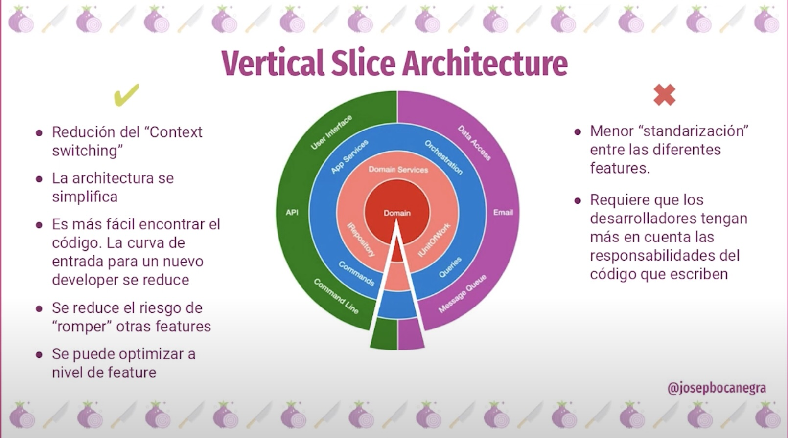
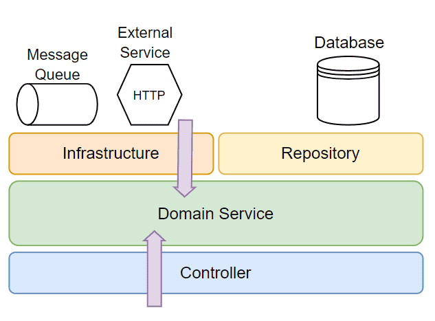
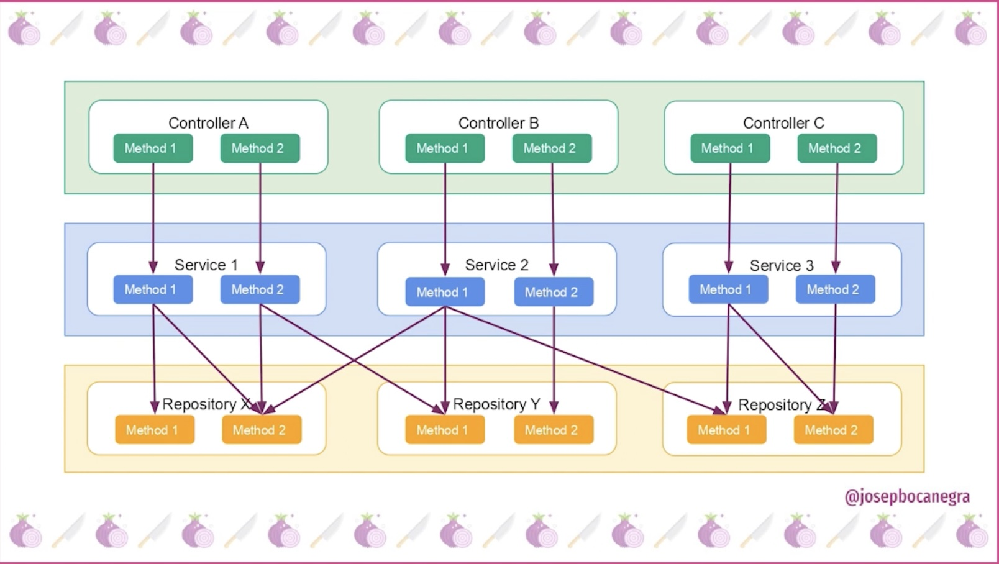
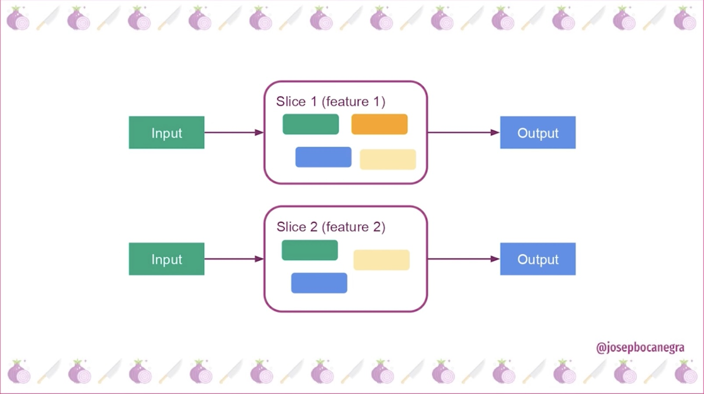
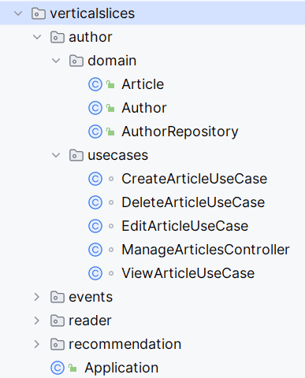

# Vertical Slice Architecture

## Arquitectura en Capas

Antes de explorar la Arquitectura de Corte Vertical, revisemos primero las características clave de su principal contraparte, la Arquitectura en Capas. Los diseños en capas son populares y ampliamente utilizados, con variaciones como la Arquitectura Hexagonal, Onion, Puertos y Adaptadores, y la Arquitectura Limpia.

La Arquitectura por Capas se centra en agrupar componentes por preocupaciones técnicas, en lugar de capacidades de negocio. Si bien es popular y ampliamente utilizada, agrupar servicios y controladores según capas técnicas, como persistencia de datos y lógica de negocio, puede llevar a un acoplamiento alto y a una cohesión baja.

## Problemas de la Arquitectura por Capas

1. Alto Acoplamiento: Los servicios suelen depender unos de otros, lo que incrementa las probabilidades de interferencia entre flujos de trabajo no relacionados.

2. Baja Cohesión: El código para un caso de uso se dispersa en varias capas y paquetes, lo que complica los cambios y el mantenimiento.

3. Cambio Extensivo: Incluso una modificación menor puede requerir cambios en múltiples capas.

## Arquitectura Corte Vertical

La Arquitectura de Corte Vertical organiza el código de acuerdo con capacidades de negocio específicas. Además, podemos agrupar casos de uso relacionados en partes cohesivas que se alineen con el dominio de negocio. Esto da lugar a módulos cohesivos que abarcan múltiples capas técnicas (como controladores, servicios y repositorios) pero sin estar agrupados por separado.

### Ventajas

1. Modularidad y Escalabilidad: La arquitectura vertical slice organiza el código en "rebanadas" que representan funcionalidades completas, lo que permite una mayor modularidad. Esto facilita la escalabilidad y el mantenimiento, ya que los cambios en una funcionalidad no afectan a otras.

2. Desarrollo Independiente: Cada "slice" puede ser desarrollado de manera independiente por diferentes equipos, lo que reduce conflictos y mejora la colaboración entre desarrolladores. Esto es especialmente útil en equipos grandes o distribuidos.

3. Reducción de Acoplamiento: Minimiza el acoplamiento entre diferentes funcionalidades (slices) mientras maximiza el acoplamiento dentro de cada slice. Esto permite que cada slice gestione su propia lógica y dependencias, lo que simplifica el proceso de desarrollo.

4. Mejora en la Eficiencia del Desarrollo: Al permitir que cada funcionalidad se implemente y pruebe de forma aislada, se puede entregar valor al usuario más rápidamente, ya que cada slice puede ser completado y puesto en producción en iteraciones cortas.

5. Flexibilidad en el Diseño: Nos permite personalizar enfoques para cada componente y determinar la manera más efectiva de organizar el código para cada caso de uso. En otras palabras, podemos utilizar diversas herramientas, patrones o paradigmas sin imponer un estilo de codificación específico ni dependencias en toda la aplicación. Además, esta flexibilidad facilita enfoques como el Diseño Orientado al Dominio (DDD) y CQRS. Aunque no son obligatorios, son muy adecuados para una aplicación con esta arquitectura.

### Desventajas

1. Complejidad en Proyectos Pequeños: Para proyectos más pequeños o con equipos menos experimentados, esta arquitectura puede introducir una complejidad innecesaria. La necesidad de gestionar múltiples slices puede llevar al caos si no hay una buena organización.

2. Curva de Aprendizaje: Requiere que los desarrolladores tengan un buen entendimiento de refactorización y patrones de diseño para manejar adecuadamente las "code smells" (malos olores en el código). Esto puede ser un desafío para equipos menos experimentados.

3. Requiere una buena planificación: Es importante planificar cuidadosamente los cortes verticales para asegurar que cubran todas las funcionalidades del sistema y que se puedan integrar de manera eficiente.

4. Mayor riesgo de duplicación de código: Si no se tiene cuidado, puede haber duplicación de código entre diferentes cortes verticales, lo que dificulta el mantenimiento a largo plazo.

### Flujo

### Modelado con DDD

El Diseño guiado por el dominio (DDD) es un enfoque que enfatiza la modelación del software basándose en el dominio de negocio central y su lógica. En DDD, el código debe utilizar términos y un lenguaje familiar para las personas de negocio y los clientes, con el fin de alinear las perspectivas técnicas y de negocio.

Además, DDD utiliza contextos delimitados para definir límites específicos, garantizando distinciones claras entre diferentes partes del sistema:

## Referencias

https://www.milanjovanovic.tech/blog/vertical-slice-architecture

https://www.baeldung.com/java-vertical-slice-architecture